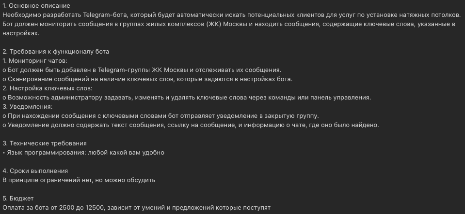

# Telegram_searcher
Сервис для поиска определенных телеграм сообщений из публичных групп. Работает с json структурами и sql файлами.

Как запускать:
1. В директории исполнительного файла должен быть валидный "*.session" файл, потому что без него не будет работать telethon библиотека. Чтобы его получить необходимо запустить ```main_telethon.exe``` или ```main_telethon.py``
2. В директории также должен быть файл .env, в котором должно быть написано
```BOT_TOKEN="<Токен вашего бота>"```
3. Дальше запустите файл ```main.exe``` или ```main.py```
4. Если все действия выше были совершены верно, то программа запустится без проблем.
